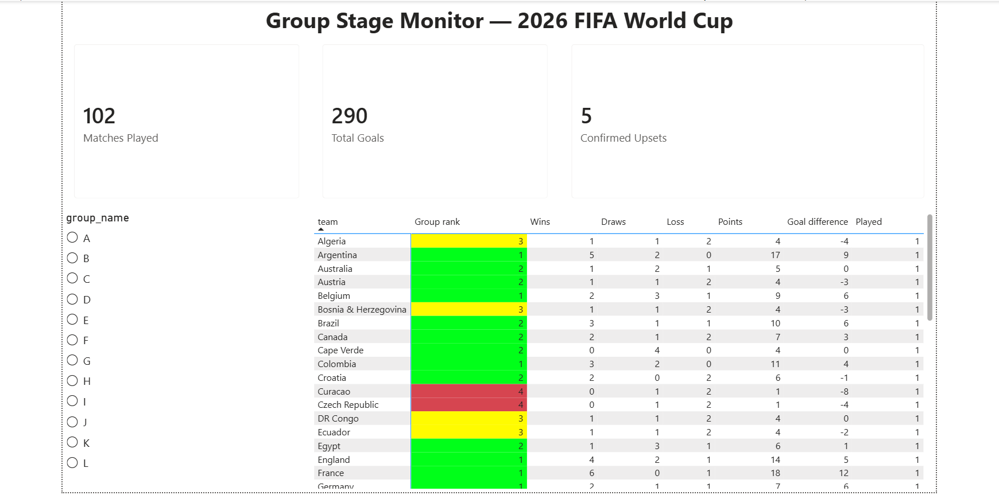
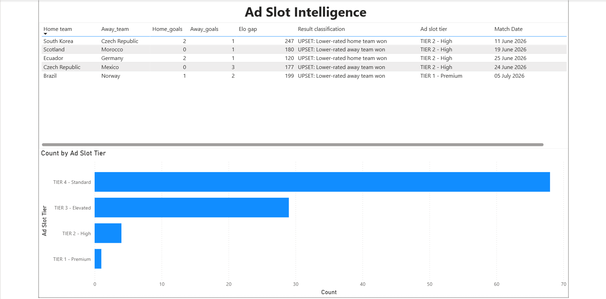
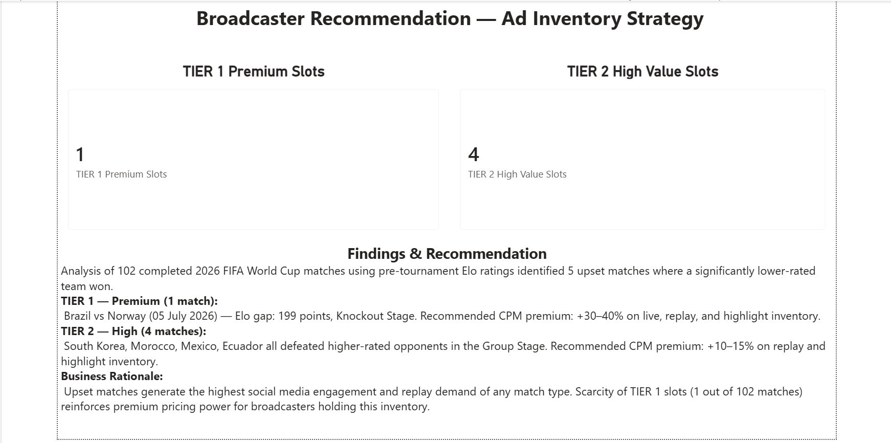

# Live Broadcaster Engagement & Monetization Strategy Pipeline
### 2026 FIFA World Cup — End-to-End Data Analytics Project

This project builds a live data pipeline that tracks the 2026 FIFA World Cup and identifies which matches represent the highest-value advertising inventory for broadcasters — using Python, SQL, and Power BI.

Broadcasters sell advertising slots around live match coverage, and the price of those slots scales with expected viewership. Viewership, in turn, is driven by match stakes — elimination drama and especially **upsets**, where a lower-ranked team beats a strong favourite. This pipeline quantifies that signal in real time: it ingests live tournament data, calculates group standings, identifies upset matches using pre-tournament team strength ratings, and classifies every match into an advertising-value tier — turning raw football data into a broadcaster monetisation recommendation.

---

## What This Project Demonstrates

- **REST/public API data extraction** with Python (`requests`, `csv`, secure credential handling via `.env`)
- **SQL data engineering**: dimensional modelling, `UNION ALL` aggregations, multi-table `JOIN`s across three data sources, and `RANK() OVER` window functions
- **Business intelligence**: translating raw match data into a quantified ad-revenue recommendation framework
- **Data quality handling**: name standardisation across data sources, NULL handling, and type enforcement — all encountered and resolved as real engineering problems (see `queries.sql` for the full log)

---

## Tech Stack

| Layer | Tool |
|---|---|
| Extraction | Python (`requests`, `python-dotenv`) |
| Data Source | [openfootball/worldcup.json](https://github.com/openfootball/worldcup.json) (live match data) |
| Transformation | MySQL 8.0 / MySQL Workbench |
| Visualisation | Power BI |

---

## Pipeline Architecture

```
openfootball public JSON (live World Cup 2026 data)
     ↓  [Python: extract_matches.py]
matches.csv (raw, 104 fixtures)
     ↓  [MySQL: queries.sql — 8 SQL transformation stages]
team_groups · elo_ratings · matches_clean · team_match_stats
     ↓
group_standings · final_standings · high_engagement_matches
     ↓  [CSV export]
final_standings.csv + high_engagement_matches.csv
     ↓  [Power BI]
Broadcaster Optimization Dashboard
```

---

## Repository Structure

```
worldcup_pipeline/
├── extract_matches.py          # Python extraction script
├── queries.sql                 # All SQL: schema, transformations, and a
│                                #   documented log of every error encountered
│                                #   and how it was resolved
├── data/
│   ├── raw/
│   │   └── matches.csv         # Raw extracted fixtures
│   ├── processed/
│   │   ├── final_standings.csv         # Ranked group standings
│   │   └── high_engagement_matches.csv # Upset analysis + ad-slot tiers
│   └── reference/
│       └── elo_ratings_wc2026.csv      # Reference Elo data
└── README.md
```

---

## How to Run This Project

1. Clone the repository:
   ```bash
   git clone https://github.com/vishnusdb/worldcup-broadcaster-pipeline.git
   cd worldcup-broadcaster-pipeline
   ```

2. Install Python dependencies:
   ```bash
   pip3 install requests python-dotenv
   ```

3. Run the extraction script to pull the latest match data:
   ```bash
   python3 extract_matches.py
   ```
   once the data is gattered
   run the ASCII SCRIPT 
   cd ~/Desktop/worldcup_pipeline && python3 -c "
import csv, requests
from pathlib import Path

URL = 'https://raw.githubusercontent.com/openfootball/worldcup.json/master/2026/worldcup.json'
data = requests.get(URL).json()
matches = data.get('matches', [])

OUTPUT_PATH = Path('data/raw/matches.csv')
FIELDNAMES = ['fixture_id','match_date','round','group_name','status_short','home_team','away_team','home_goals','away_goals']

def clean(s):
    if not s: return s
    replacements = {'ç':'c','Ç':'C','ô':'o','é':'e','è':'e','ê':'e','î':'i','ã':'a','á':'a','à':'a','ú':'u','ü':'u','ñ':'n','ó':'o','ö':'o'}
    for k,v in replacements.items():
        s = s.replace(k,v)
    return s

rows = []
for i, m in enumerate(matches, 1):
    ft = m.get('score', {}).get('ft', [None, None])
    hg = ft[0] if ft and len(ft) > 0 else None
    ag = ft[1] if ft and len(ft) > 1 else None
    rnd = m.get('round', '')
    grp = m.get('group', rnd)
    rows.append({
        'fixture_id': i,
        'match_date': m.get('date',''),
        'round': clean(rnd),
        'group_name': clean(grp),
        'status_short': 'FT' if hg is not None else 'NS',
        'home_team': clean(m.get('team1','')),
        'away_team': clean(m.get('team2','')),
        'home_goals': hg if hg is not None else '',
        'away_goals': ag if ag is not None else '',
    })

with open(OUTPUT_PATH, 'w', newline='', encoding='ascii', errors='replace') as f:
    writer = csv.DictWriter(f, fieldnames=FIELDNAMES)
    writer.writeheader()
    writer.writerows(rows)
print('Done -', len(rows), 'rows,', sum(1 for r in rows if r['status_short']=='FT'), 'completed,', sum(1 for r in rows if r['status_short']=='NS'), 'upcoming')
"

4. Open `queries.sql` in MySQL Workbench (or any MySQL 8.0+ client) and run it top to bottom against a fresh database to rebuild all transformation tables.

5. Export `final_standings` and `high_engagement_matches` as CSVs and load them into Power BI to rebuild the dashboard.

---
## Key Insight (as of July 2026)

Five confirmed upsets have been identified across the tournament so far, including one TIER 1 Premium knockout-stage upset:

| Match | Result | Elo Gap | Ad Slot Tier |
|---|---|---|---|
| South Korea vs Czech Republic | 2–1 | 247 | TIER 2 — High |
| Scotland vs Morocco | 0–1 | 180 | TIER 2 — High |
| Czech Republic vs Mexico | 0–3 | 177 | TIER 2 — High |
| Ecuador vs Germany | 2–1 | 120 | TIER 2 — High |
| **Brazil vs Norway** | **1–2** | **199** | **TIER 1 — Premium** |

Brazil vs Norway stands out as the highest-value advertising slot of the tournament — a TIER 1 Premium upset in the knockout stage with a 199-point Elo gap, the only match of its kind across 102 completed fixtures.
Ecuador's win over Germany stands out as the highest-profile shock relative to pre-tournament expectations, and under this model would justify a premium CPM recommendation on replay and highlight inventory for that match.

---
## Dashboard Screenshots

### Page 1 — Group Stage Monitor


### Page 2 — Ad Slot Intelligence


### Page 3 — Broadcaster Recommendation


---

## Author

Vishnu Gautam — Mechanical Engineering student, building data analytics portfolio projects for Business/Product Analyst roles.
